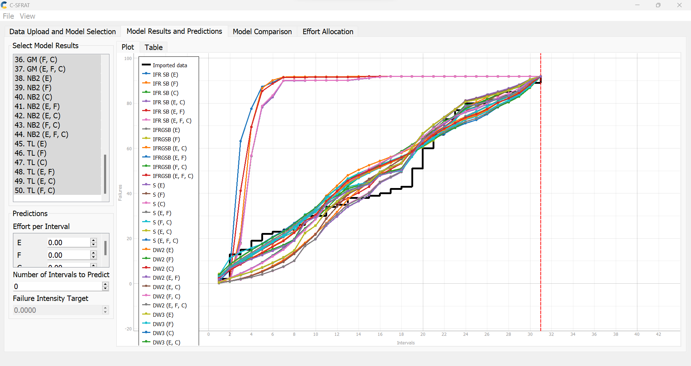
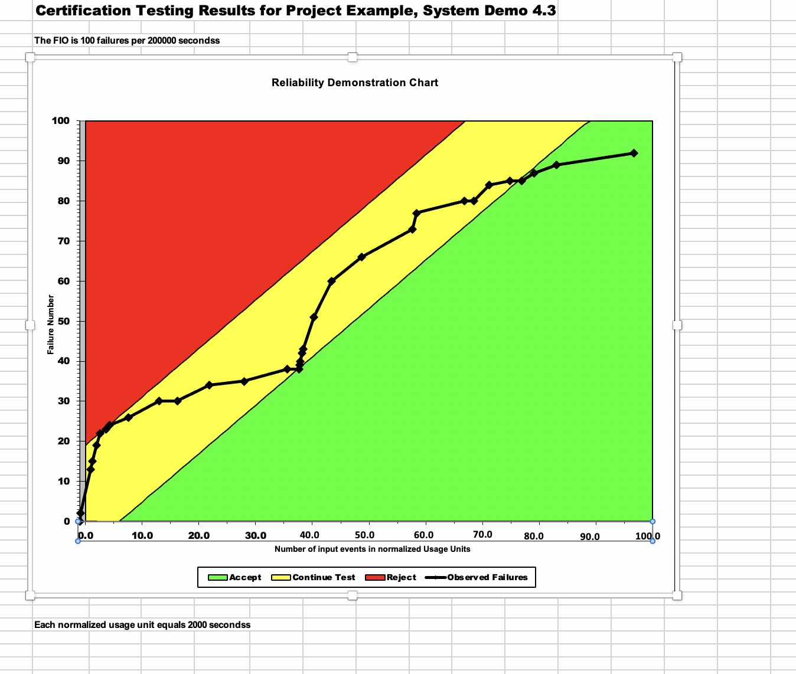
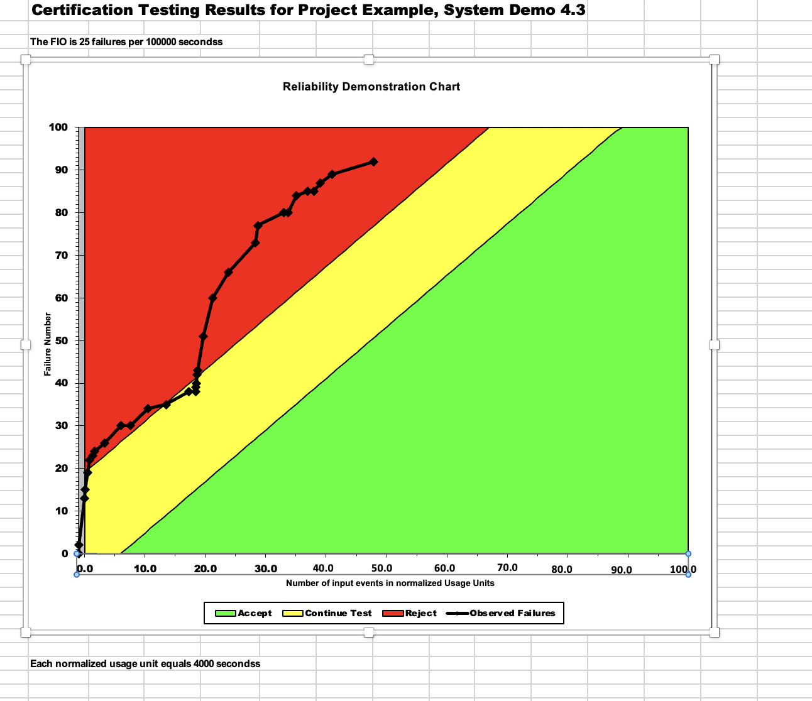
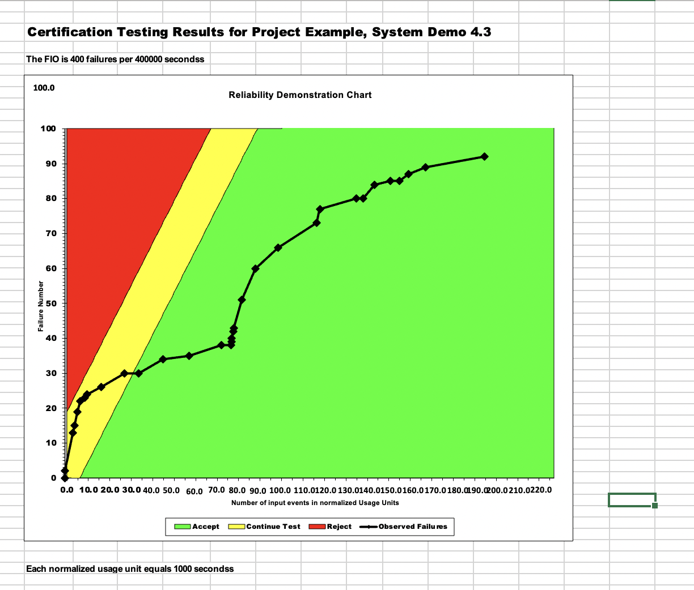

**SENG 438- Software Testing, Reliability, and Quality**

**Lab. Report \#5 – Software Reliability Assessment**

| Group \#21:       |   |
|-----------------|---|
| Student Names:  | Lauraine Baffot  |
|                 | Alexis Hamrak  |
|                 | Abhay Kholsa  |
|                 | Rachel Renegado  |

# Introduction
The main purpose of this lab was to help us discover the reliability assessment and the usage of the tools such as C-SFRAT and the Reliability Demonstration Chart with the help of Excel. This lab assignment also explored the failure reliability growth testing which helps analyze the product’s changes over a period of time. Additionally, this lab also introduced to us the concept of failure data which is critical to analyze as it can aid us in determining how to prevent future failures. Overall, these new concepts solidified the theoretical lectures helped us understand where reliability testing plays its role in software testing procedures. 
# 

# Assessment Using Reliability Growth Testing 
### Result of model comparison (selecting top two models)
In this section of the lab assignment, we had to select the best two models using the failure data provided to us the benefit of using the C-SFRAT was that we could simply import the CSV file into this GUI and we could use the functions to determine which fits in well with our data, this feature of Model Results and Predictions it will enable us to narrow which function resembles the closest to the failure data. To approach finding the best two models we select all the possible comparisons we could perform with the covariates. Here we can see all of the models which were selected to see which one would fit the best into our failure data. 

# Result of range analysis (an explanation of which part of the data is good for proceeding with the analysis)

# Plots for failure rate and reliability of the SUT for the test data provided	

# A discussion on decision making given a target failure rate	

# A discussion on the advantages and disadvantages of reliability growth analysis

# Assessment Using Reliability Demonstration Chart 
## 3 plots for MTTFmin, twice and half of it for your test data (15 marks -> 5 each)
### MTTFmin 

The above image displays the plot for MTTFmin. Through trial and error, we developed the plot above using the provided failure data as input to visualize the reliability of the system. As plotted, the reliability trend displayed suggests that the trend is acceptable for our FIO (does not dive heavily in the reject range). The calculation for MTTF, in this case, is 100/200,000, which gives an MTTF of 0.0005. 

### Half MTTFmin

The above image displays the plot for half MTTF. After the MTTFmin plot was found, the parameters were adjusted accordingly for half of the previous MTTF. The calculation for MTTF, in this case, is 25/100,000, which gives an MTTF of 0.00025. This trend dives more within the reject range which corresponds to the changes we made for this graph. Since we __decreased__ the number of acceptable failures, our failures in the half MTTF plot should have more data points in the __reject__ region. 

### Twice MTTFmin

The above image displays the plot for twice MTTF. After the MTTFmin plot was found, the parameters were adjusted accordingly for twice of the initial MTTF. The calculation for MTTF in this case is 400/400,000, which gives an MTTF of 0.001. This trend dives more within the acceptable range which corresponds to the changes we made for this graph. Since we __increased__ the number of acceptable failures, our failures in the twice MTTF plot should have more data points in the __accept__ region.

# Comparison of Results

# Discussion on Similarity and Differences of the Two Techniques

# How the team work/effort was divided and managed

# 

# Difficulties encountered, challenges overcome, and lessons learned

# Comments/feedback on the lab itself
